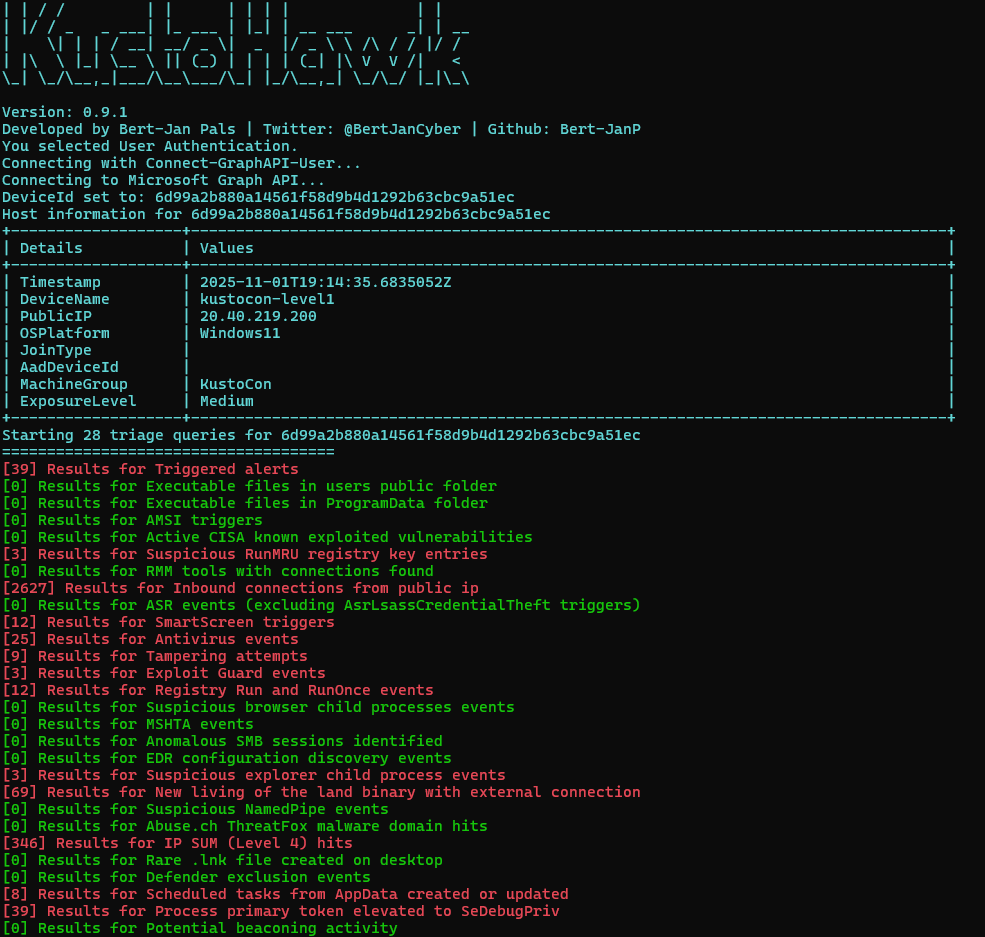
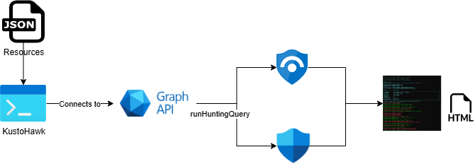

# KustoHawk 🦅

KustoHawk is a incident triage and response tool for Microsoft Defender XDR and Sentinel environments. The script collects common indicators of compromise and returns a complete picture of the activities performed by an device of account. The tool leverages Graph API to run the hunting queries across your unified XDR environment. The queries that are executed are listed in the [Resources](./Resources/) folder. The script only outputs hits, but with verbose (-v) or export (-e) mode enabled the results are shown on the terminal or exported to CSV files for further investigation.



## Architecture
KustoHawk is based on the [KustoHawk.ps1](./KustoHawk.ps1) PowerShell script that connects to the Graph API to run hunting queries. The output is shared in the commandline and presented in HTML exports.



## Usage
The script supports multiple authentication options to connect the script to the Graph API. Set one of the below options in the *AuthenticationMethod* parameter, in case of ServicePrincipal signins you have to add application configuration in the script.

- User
- ServicePrincipalSecret
- ServicePrincipalCertificate (implementation in development)

By default the data from the last 7 days is collected, this can be adjusted using the *[-TimeFrame] <String>* parameter.

### Permissions
The script required ThreatHunting.Read.All permissions to execute the [runHuntingQuery](https://learn.microsoft.com/en-us/graph/api/security-security-runhuntingquery?view=graph-rest-1.0&tabs=http) Graph API calls.

### Prerequisites
The script requires the Microsoft.Graph.Security to run queries.

```PowerShell
Install-Module Microsoft.Graph.Security
```

### Parameters

```Powershell
KustoHawk.ps1 [[-DeviceId] <String>] [[-UserPrincipalName] <String>] [-VerboseOutput] [-Export] 
    [[-TimeFrame] <String>] [-AuthenticationMethod] <String> [<CommonParameters>]
```

To get the scripts information and examples inline run:

```Powershell
Get-Help .\KustoHawk.ps1
```

### Examples

**Example 1: Collecting Device and Idenity information with user authentication**

```PowerShell
.\KustoHawk.ps1 -DeviceId 2694a7cc2225f3b66f7cf8b6388a78b1857fadca -upn user@contonso.com -AuthenticationMethod User
```

**Example 2: Collecting Device information with csv exports enabled with a set timeframe of 14 days**

```PowerShell
.\KustoHawk.ps1 -DeviceId 2694a7cc2225f3b66f7cf8b6388a78b1857fadca -AuthenticationMethod User -TimeFrame 14d -e
```

## Table Requirements
To get results for all queries the tables below are required. It is no issue if you do not have all tables, it will result in less results.

### Device Traige
- Unified Security Platform Alerts (AlertEvidence, AlertInfo) 
- Defender For Endpoint (DeviceFileEvents, DeviceEvents, DeviceTvmSoftwareVulnerabilities, DeviceRegistryEvents, DeviceNetworkEvents, DeviceProcessEvents, DeviceInfo)

### Identity Triage
- Unified Security Platform Alerts (AlertEvidence, AlertInfo) 
- Entra ID Logs (AADUserRiskEvents, SigninLogs, AuditLogs, AADSignInEventsBeta)
- AzureActivity
- Defender For Identity (IdentityInfo)
- GraphAPIAuditEvents
- Defender For Cloud Apps (CloudAppEvents)

## Contribute
Contributions are highly appriciated! You can contribute by adding new queries to the JSON files in the [Resources](./Resources/) folder. Create a pull request for the new queries.

The JSON has three required fields:
- "Name": Name of the query.
- "Query": The query to execute. The PowerShell script replaces the variables *{DeviceId}*, *{TimeFrame}* and *{UserPrincipalName}* in the KQL to the input values of the script.
- "Source": The source of the query, credit should be given where credit is due. 
- "ResultCount": Number of hits last run
```JSON
{
    "Name": "Triage query one",
    "Query": "let Device = '{DeviceId}';\r\nAlertEvidence\r\n| where DeviceId =~ Device\r\n| where Timestamp > ago({TimeFrame})\r\n| where EntityType == 'Machine'\r\n| summarize arg_max(Timestamp, *) by AlertId\r\n| project AlertId\r\n| join kind=inner AlertInfo on AlertId\r\n| extend AlertLink = strcat('https://security.microsoft.com/alerts/', AlertId)\r\n| project-reorder Timestamp, Title, Category, Severity, DetectionSource, AlertLink\r\n| sort by Timestamp desc",
    "Source": "https://github.com/Bert-JanP/Hunting-Queries-Detection-Rules/blob/main/DFIR/XDR%20-%20DeviceAlerts.md",
    "ResultCount":  22
}
```

**Translate KQL query to single line string**

The query field in the json should be a single line string, the PowerShell script below can be used to translate the query to the right format.

```PowerShell
$Query = "let Upn = '{UserPrincipalName}';
let TimeFrame = {TimeFrame};
AADUserRiskEvents
| where TimeGenerated > ago(TimeFrame)
| where UserPrincipalName =~ Upn
| summarize arg_max(TimeGenerated, *) by UserPrincipalName
| project TimeGenerated, UserPrincipalName, RiskState, RiskLevel, RiskDetail, RiskEventType"
$Output = $Query -replace '\r','\r' -replace '\n','\n'
Write-Output $Output
```